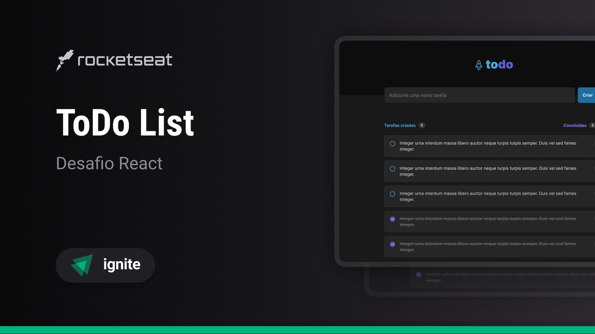

<h1 align="center"> To Do List </h1>
<h2 align="center"> Desafio do ReactJS na Rocketseat 🚀</h2>

  <a href="#-tecnologias">Tecnologias</a>&nbsp;&nbsp;&nbsp;|&nbsp;&nbsp;&nbsp;
  <a href="#-projeto">Projeto</a>

 

  

## 🚀 Tecnologias

Esse projeto foi desenvolvido com as seguintes tecnologias:

- HTML e CSS
- React e Typescript
- Git e Github

## 💻 Projeto

Esse projeto é uma aplicação de controle de tarefas no estilo to-do list.

---
